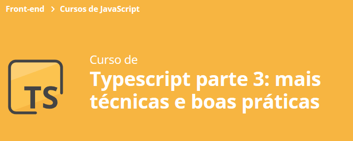

### Aula 1:
- Introdução e estrutura do projeto; :white_check_mark:
- Requisitos não funcionais; :white_check_mark:
- Decorator de método; :white_check_mark:
- Logar tempo de execução com decorator. :white_check_mark:

### Aula 2:
- Decorator com parâmetro; :white_check_mark:
- Criação de um decorator de inspeção; :white_check_mark:
- Ordem de execução dos decorators; :white_check_mark:
- Simplificação no design de decorators; :white_check_mark:
- Portabilidade de funcionalidade antiga para decorators. :white_check_mark:

### Aula 3:
- 

### Aula 4:
- 

### Aula 5 final:
- 

## 🔨 A saber sobre o curso
- Conheça as vantagens do uso de Decorators;
- Crie diferentes tipos de decorators e deixe seu código ainda mais elegante;
- Compreenda os benefícios do uso de interfaces;
- Aprenda a organizar e a adicionar tipo em seu código ao consumir uma API REST;
- Entenda o papel de sourceMaps e aprenda como debugar a sua aplicação no navegador;
- Crie soluções combinando tudo o que aprendeu nos módulos anteriores;
- Tire benefício do Polimorfismo garantindo um código protegido e dinâmico.

## ✔️ Técnicas e tecnologias utilizadas
- `HTML & CSS`
- `TypeScript`
- `JavaScript`
- `Bootstrap`

## 🛠️ Abrir e rodar o projeto
Para abrir e rodar o projeto, execute `npm i` para instalar as dependências e `npm run start` para iniciar o projeto.

## 📚 Mais informações do curso
Busque na plataforma da Alura o curso **Typescript parte 3: mais técnicas e boas práticas** publicado na Escola Frontend.

 
